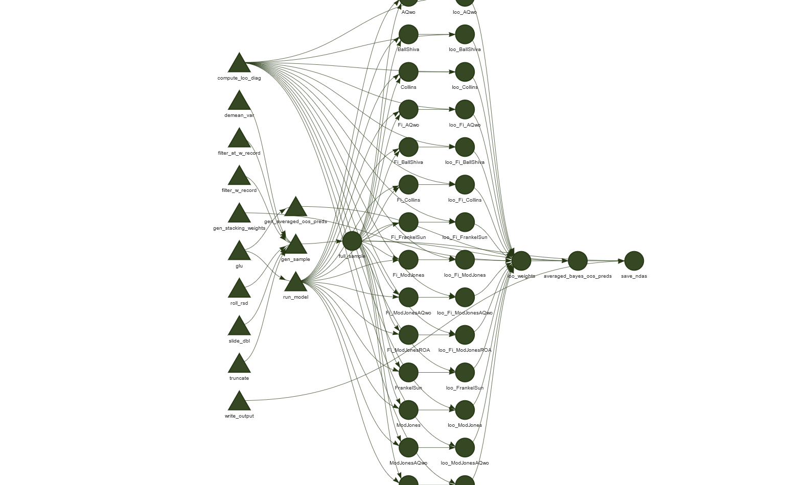

# Public Repository for "Accounting for Uncertainty: An Application of Bayesian Methods to Accruals Models"

This repository holds code to compute model averaged predictive distributions for accruals. It provides the necessary materials to replicate and extend the approach as proposed in *"Accounting for Uncertainty: An Application of Bayesian Methods to Accruals Models"*.

The code is free to use. Comments, suggestions for improvements, and reporting of issues are welcome.

## Non-discretionary accrual estimates

Posterior means and standard deviations from the averaged model (The one described in Table 6 in the paper) can be found in the folder `accruals/`. `NDA` is the posterior mean and `NDA_sd` is the posterior standard deviation. We intend to add an updated version on a yearly basis.

## How to use this repository

The code is organized as a [targets pipeline](https://docs.ropensci.org/targets/index.html#examples). If setup properly (wrds credentials in keyring store, rstan working, etc.), all you should need to do is execute the run.R script to compute the Bayesian model averaged NDAs yourself. See the [targets documentation](https://docs.ropensci.org/targets/index.html#examples) for instructions.

Below is a snapshot of part of the dependency graph of the pipeline that is fitted:

*Note: executing the code will result in roughly 63GB of data and takes ca. 3+ days on a reasonably powerful machine. The default settings fit three models in parallel. If left at the default settings the computations are RAM hungry (64+GB) and need 8 cores to not block the system.*

While nearly all of the code is written in R, the models are coded in [Stan](https://mc-stan.org/) and all MCMC calculations are performed by Stan.

The folder structure is as follows:

- `R/`: Main code. All main code is found in functions.R with each step modularized into functions. 
- `stan/`: Bayesian models used in *"Accounting for Uncertainty"*
- `out/`: [empty] Storage location for all intermediate results, data. After fitting the models, it also contains log files with warnings etc. emitted during model fitting and mcmc diagnostic statistics and traceplots for each model.
- `accruals/`: Final storage location for our yearly NDA output
- `doc/`:  Other documentation, such as installing Stan on windows for use with Stata (probably outdated)

## Requirements

The R package rstan installs a compatible version of Stan automatically. The only prerequisite is Rtools on windows and a compatible compiler tool chain for MacOS and Linux. See the [rstan documentation](https://mc-stan.org/rstan/) for installation instructions.

In addition, the various other packages are used in different scripts:

    library(dplyr)
    library(haven)
    library(loo)
    library(slider)
    library(lubridate)
    library(matrixStats)
    library(purrr)
    library(readr)
    library(RPostgres)
    library(rstan)
    library(stringr)
    library(tidyr)
    library(zoo)
    library(keyring)
    library(glue)
    library(future.callr)
    library(future)
    library(targets)
    
see the keyring documentation for storing username and passwords

    keyring::default_backend()
    keyring::key_set("wrds_user")
    keyring::key_set("wrds_pw")
    keyring::key_list()

These are the versions used:

    > sessionInfo()
    R version 4.1.0 (2021-05-18)
    Platform: x86_64-w64-mingw32/x64 (64-bit)
    Running under: Windows 10 x64 (build 19043)

    Matrix products: default

    locale:
    [1] LC_COLLATE=English_United States.1252  LC_CTYPE=English_United States.1252   
    [3] LC_MONETARY=English_United States.1252 LC_NUMERIC=C                          
    [5] LC_TIME=English_United States.1252    

    attached base packages:
    [1] stats     graphics  grDevices utils     datasets  methods   base     

    other attached packages:
    [1] targets_0.4.2        future.callr_0.6.1   future_1.21.0        glue_1.4.2          
    [5] keyring_1.2.0        zoo_1.8-9            tidyr_1.1.3          stringr_1.4.0       
    [9] rstan_2.21.2         ggplot2_3.3.5        StanHeaders_2.21.0-7 RPostgres_1.3.2     
    [13] readr_1.4.0          purrr_0.3.4          matrixStats_0.59.0   lubridate_1.7.10    
    [17] slider_0.2.1         loo_2.4.1            haven_2.4.1          dplyr_1.0.7         

    loaded via a namespace (and not attached):
    [1] Rcpp_1.0.6         lattice_0.20-44    listenv_0.8.0      prettyunits_1.1.1 
    [5] ps_1.6.0           assertthat_0.2.1   digest_0.6.27      utf8_1.2.1        
    [9] V8_3.4.2           parallelly_1.26.0  R6_2.5.0           backports_1.2.1   
    [13] stats4_4.1.0       pillar_1.6.1       rlang_0.4.11       curl_4.3.2        
    [17] data.table_1.14.0  callr_3.7.0        blob_1.2.1         checkmate_2.0.0   
    [21] igraph_1.2.6       bit_4.0.4          munsell_0.5.0      compiler_4.1.0    
    [25] pkgconfig_2.0.3    pkgbuild_1.2.0     globals_0.14.0     tidyselect_1.1.1  
    [29] tibble_3.1.2       gridExtra_2.3      codetools_0.2-18   fansi_0.5.0       
    [33] crayon_1.4.1       withr_2.4.2        grid_4.1.0         jsonlite_1.7.2    
    [37] gtable_0.3.0       lifecycle_1.0.0    DBI_1.1.1          magrittr_2.0.1    
    [41] scales_1.1.1       warp_0.2.0         RcppParallel_5.1.4 cli_2.5.0         
    [45] stringi_1.6.2      ellipsis_0.3.2     generics_0.1.0     vctrs_0.3.8       
    [49] tools_4.1.0        forcats_0.5.1      bit64_4.0.5        hms_1.1.0         
    [53] yaml_2.2.1         processx_3.5.2     parallel_4.1.0     inline_0.3.19     
    [57] colorspace_2.0-2  
    > 

## Installing cmdstan for use with STATA

Stan is easiest to use with R or Python. We provide some code to run Bayesian computations using Stata as well. Getting Stata to play nicely with Stan is not completely trivial, but there are bindings called [StataStan](https://mc-stan.org/users/interfaces/stata-stan.html). We provide a short manual for setting up cmdstan for use with Stata in the `doc/` folder. The rest is explained at the StataStan homepage.
